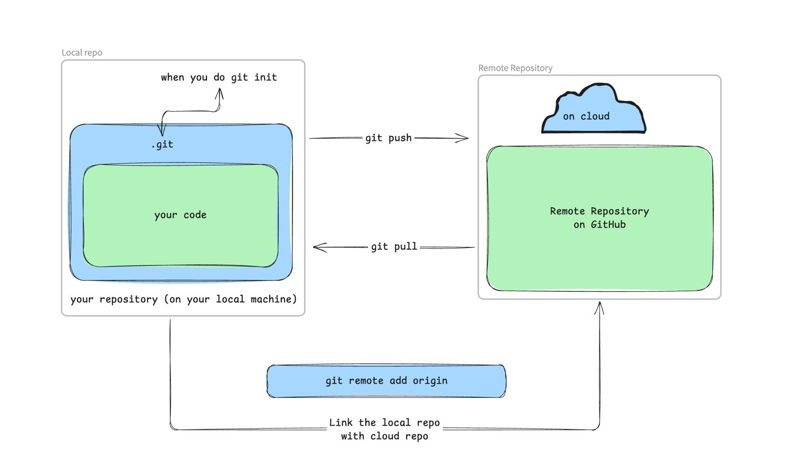

# Git fundamentals

## Basics

_List of things we are going to cover_

- [ ] What is git?
- [ ] Why to use git?
- [ ] What is a repository?
- [ ] How to use git effectively?
- [x] tracking file changes
  - [x] adding files
  - [x] commiting changes
  - [x] git log
- [x] commit message ethics
- [x] creating and linking remote repository
- [x] add collaborators on GitHub repository
- [ ] git push and git pull
- [ ] branches in Git
  - [ ] creating a new branch
  - [ ] switching to a different branch
- [ ] .gitignore
- [ ] conflicts/common issues between remote and local repository
  - [ ] upstream branch does not exist
  - [ ] cannot push changes upstream has some changes which doest not exist locally
  - [ ] cannot push to remote repository changes are very large.

## What is git?

_in next session_

## Why to use git?

_in next session_

## What is a repository?

_in next session_

## How to use git effectively?

_in next session_

## How to link the remote repository (on GitHub)?

_Fig. Difference between Remote and Local Repository_

1. Initialize a repository on your local machine
   - Using `git init` command (do git init onlyl once)
2. Use command `git remote add origin <respository-url>`

## When to commit a change?

1. When you have a stable version of your code.
2. When you want to make a change but you are not sure if it will break existing code.

## When not to commit a change?

1. When you did a very small change which is not going to improve your application.

## Commit messages

1. You fixed something

   1. **FIX:** {what did you fixed}
      - fixed an error
      - updated links (html page)
      - build error (react app)
      - updated dependencies (python)
      - and more

2. You added a new feature

   1. **FEAT:** {new feature description}
      - you added a new webpage to a website
      - created a new button
      - basically any new feature into existing code

3. You did a small change

   1. **CHORE:** {your small change}
      - you updated background colour
      - changed variable names
      - updated documentation

4. You updated the documentation
   1. **DOC:** {what did you update}
      - You made changes in the documentation
      - you added some comments in the code to understand the code better
