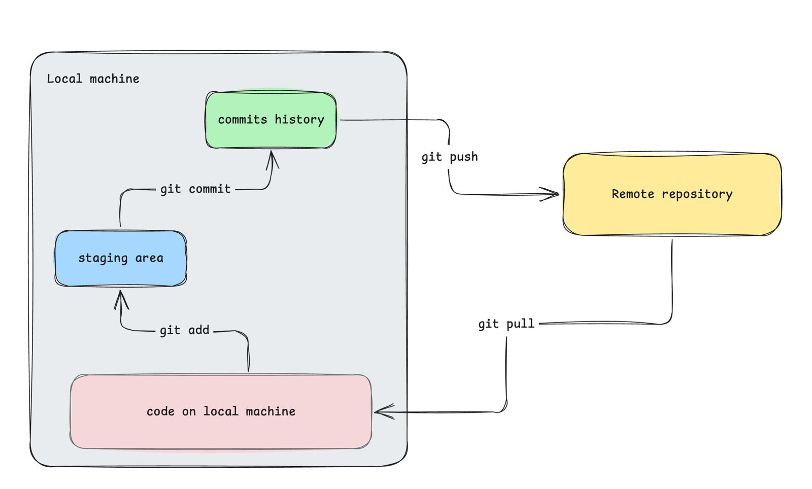

# Git fundamentals

## Basics

_List of things we are going to cover_

- [x] tracking file changes
  - [ ] adding files
  - [ ] commiting changes
  - [ ] git log
- [ ] commit message ethics
- [ ] creating and linking remote repository

## How to use git effectively?

_in next session_

## How to link the remote repository (on GitHub)?

_in next session_

## When to commit?

1. When you have a stable version of your code.
2. When you want to make a change but you are not sure if it will break existing code.

## When not to commit?

1. When you did a very small change which is not going to improve your application.

## Commit messages

1. You fixed something
   1. **FIX:** {what did you fixed}
      - fixed an error
      - updated links (html page)
      - build error (react app)
      - updated dependencies (python)
      - and more

2. You added a new feature
   1. **FEAT:** {new feature description}
      - you added a new webpage to a website
      - created a new button
      - basically any new feature into existing code

3. You did a small change
   1. **CHORE:** {your small change}
      - you updated background colour
      - changed variable names
      - updated documentation

4. You updated the documentation
   1. **DOC:**  {what did you update}
      - You made changes in the documentation
      - you added some comments in the code to understand the code better
